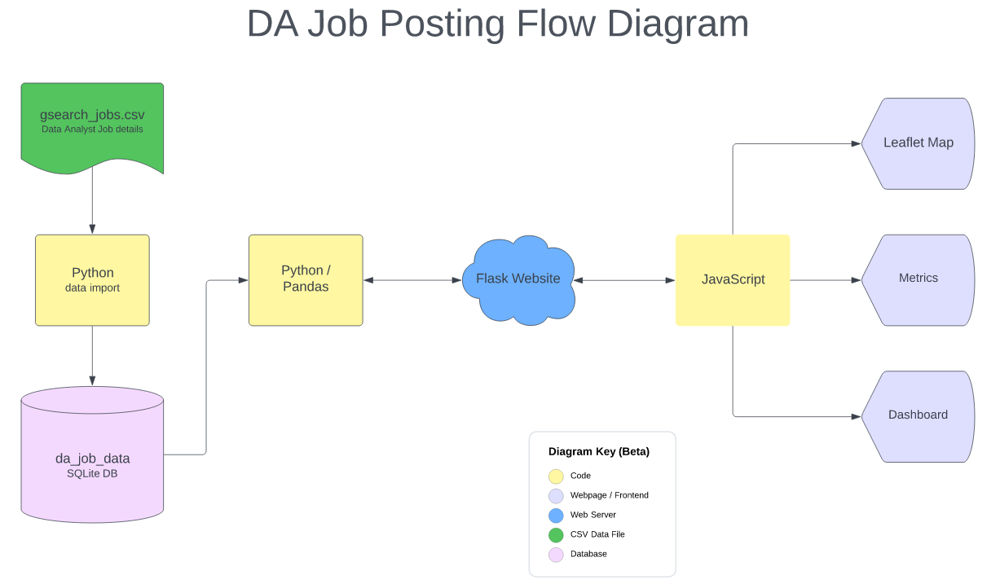

# Project 3 - DA Job Posting Analysis

## Project Outcome
Through our research, we found a [dataset](doc:https://www.kaggle.com/datasets/lukebarousse/data-analyst-job-postings-google-search) from kaggle with over 10,000 job positings so far as well as daily updates from Google's job search results for Data Analyst positions in the United States. We successfully sourced data from kaggle, imported it into a `SQLITE` database and leveraged `python` and `javascript` to createa an web application.  

Our web application has a landing page and links to three distinct areas to highight: 
- a `Leaflet` map of the United States showcases the tendency of data analyst job in demand across the country.
- interactive `javascript` viualization 
- `python` data analysis including 
   - job posting detail; 
   - job titles with average salary rate; 
   -  `natural language processing` results on popular soft and hard skills in demand;

### Top-Level Directory Layout

    ├── data                    # datasource .csv file from Kaggle is stored here.  JSON files stored here for endpoints.
    ├── notebooks               # production notebook and files with code promoted from sandbox after testing.
    ├── sandbox                 # sandbox environment for EDA, testing, data wrangling.
    ├── static                  # static files for our application.
    │   ├── css                 # CSS stylesheet code.
    │   ├── images              # image files.
    │   ├── js                  # javascript code.
    ├── templates               # html files for use in application.
    ├── LICENSE
    └── README.md

### Screenshots of application with summary *HERE* 

----

## Project Proposal
#### The Bureau of Labor and Statistics expects the number of hired Data Analysts to grow by [25%](doc:https://www.bls.gov/ooh/math/operations-research-analysts.htm) during the decade from 2020 to 2030. To better prepare ourselves getting into such a fast-growing filed with constant envolving, we are in urge of finding out what are the in-demand data analyst skills in the current business. 

#### With that in mind, We found a [dataset](doc:https://www.kaggle.com/datasets/lukebarousse/data-analyst-job-postings-google-search) from kaggle with almost daily updates that pulls job posting from from Google's search results for Data Analyst positions in the United States. To better understand the data that was collected, we are building an interface using Python, SQLite, HTML, CSS, JS, Flask, Leaflet that allow us to showcase the following data visualizations:  
 - Geomap showcases the the tendency of data analyst job in demand across the country.
 - Job posting overview matrix displays 
   - the top XX websites that the company choose for job postings; 
   - the median hourly rate and anually salary for data analyst position; 
   - the proportion of remote works VS In-Person/Hybrid
 - Analysis on the most required skills and the skill worth.
 - Comparasion between the most required skills in job posting and the practices that the most popuar online Boot Camps have to offer. 

----
## Team Members
- John Quinn
- Justin Bernier
- Kimberly Sernett 
- Tyler Levie
- Xuan Di

----
## Technical Specifications 
- **Datasource:**  Kaggle sourced .csv file
- **Database Engine** - SQLite 
- **Web Server:** Flask - Micro web framework
- **Programming Language** - Python / JavaScript
- **Geographical Map** - Leaflet

----

## DA Job Posting Flow diagram

----

## References
### U.S Bureau of Labor Statistics
https://www.bls.gov/ooh/math/operations-research-analysts.htm

### Dataset
https://www.kaggle.com/datasets/lukebarousse/data-analyst-job-postings-google-search
